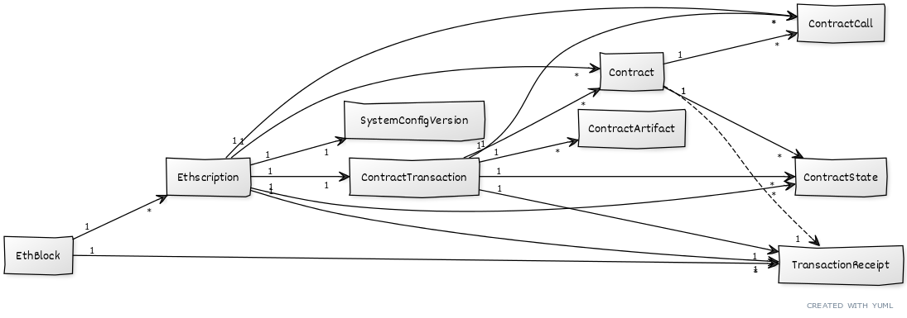

# Facet Q - Facet Models For SQL Database Queries

facetq - "stand-alone" facet (activerecord) models for easy (re)use for sql database queries and more

* home  :: [github.com/0xCompute/rubidity](https://github.com/0xCompute/rubidity)
* bugs  :: [github.com/0xCompute/rubidity/issues](https://github.com/0xCompute/rubidity/issues)
* gem   :: [rubygems.org/gems/facetq](https://rubygems.org/gems/facetq)
* rdoc  :: [rubydoc.info/gems/facetq](http://rubydoc.info/gems/facetq)





# Usage

``` ruby 
require 'facetq'

## step 1: connect to database
DB_CONFIG = {
  adapter:  'postgresql',
  encoding: 'unicode',
  database: 'ethscriptions_vm_development',
  username: '<your username here>',
  password: '<your password here>'
}
ActiveRecord::Base.establish_connection( DB_CONFIG )

## step 2: query
puts "  #{EthBlock.count} block(s)"
puts "  #{Ethscription.count} ethscription(s)"
puts "  #{TransactionReceipt.count} receipt(s)"
puts "  #{ContractArtifact.count} contract artifact(s)"
puts "  #{Contract.count} contract(s)"
puts "  #{ContractTransaction.count} contract transaction(s)"
puts "  #{ContractCall.count} contract call(s)"
puts "  #{ContractState.count} countract state(s)"
puts "  #{SystemConfigVersion.count} system config version(s)"
#=>  107353 block(s)
#    294056 ethscription(s)
#     33798 receipt(s)
#         8 contract artifact(s)
#        38 contract(s)
#     33798 contract transaction(s)
#     34295 contract call(s)
#     29541 countract state(s)
#         5 system config version(s)


## lets try some more queries
data = EthBlock.order(:block_number).limit(1)
pp data
#=> [#<EthBlock:0x000002c6e5967478
#   id: 1,
#   block_number: 18628099,
#   timestamp: 1700666063,
#   blockhash: "0x913b020664af72b6ab9b083f88eb6a74994027e72b82c4fd399c0c0672ee8f0b",
#   parent_blockhash: "0x7aede7fb325ce1f8a174b31339812214461f417f27cec455de41c8fbe38396e0",
#   imported_at: 2023-12-07 13:26:41.363973 UTC,
#   processing_state: "complete",
#   transaction_count: 0,
#   runtime_ms: 87,
#   created_at: 2023-12-07 13:26:44.55058 UTC,
#   updated_at: 2023-12-07 13:27:58.266695 UTC>]

puts 
pp data.as_json
#=> [{"block_number"=>18628099,
#     "timestamp"=>1700666063,
#     "blockhash"=>"0x913b020664af72b6ab9b083f88eb6a74994027e72b82c4fd399c0c0672ee8f0b",
#     "parent_blockhash"=>"0x7aede7fb325ce1f8a174b31339812214461f417f27cec455de41c8fbe38396e0",
#     "imported_at"=>"2023-12-07T13:26:41.363Z",
#     "processing_state"=>"complete",
#     "transaction_count"=>0}]


# and so forth
```

That's it for now.


## Bonus - More Blockchain (Crypto) Tools, Libraries & Scripts In Ruby

See [**/blockchain**](https://github.com/rubycocos/blockchain) 
at the ruby code commons (rubycocos) org.


## Questions? Comments?

Join us in the [Rubidity (community) discord (chat server)](https://discord.gg/3JRnDUap6y). Yes you can.
Your questions and commentary welcome.

Or post them over at the [Help & Support](https://github.com/geraldb/help) page. Thanks.

