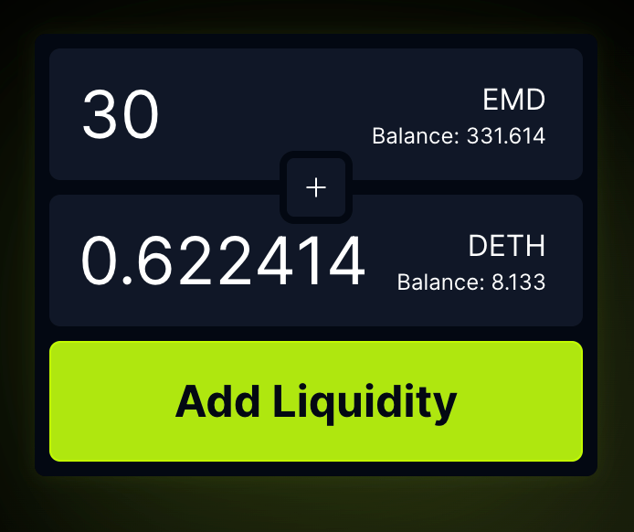
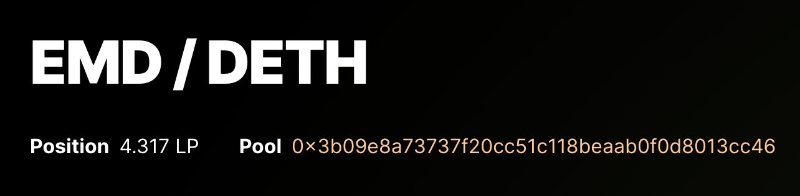
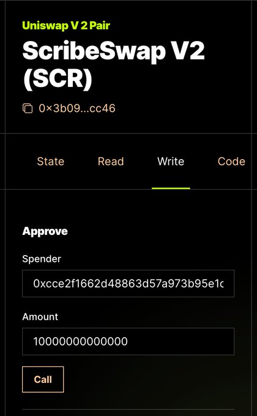
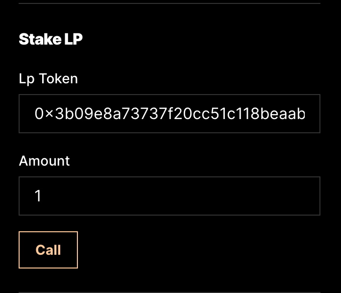
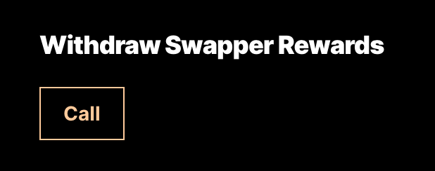

# Notes on Uniswap (Facetswap) Rewards

Middlemarch (a.k.a. Tom Lehman) writes / posts (in a [tweet thread](https://twitter.com/dumbnamenumbers/status/1720150735965573479)):

## Introducing Rewards on http://FacetSwap.com!

We're testing a new router that charges a fee and pays out rewards to:

- LP Providers
- Top Swappers
- Protocol Maintainers

Help us test this exciting feature 
and make FacetSwap even more "reward"ing!

To earn LP Rewards:

- Provide liquidity and get LP tokens.

- Stake your LP tokens and receive a portion of the fees generated on the LP token pair, similar to SushiSwap.

Start by choosing a pool from the list of pools at https://facetswap.com/pools and Adding Liquidity.

Copy the pool address from the header of the pool page and visit the pool contract on FacetScan:

http://facetscan.com/contracts/`<pool address>`

Click the "Write" tab, enter the router address (0xcce2f1662d48863d57a973b95e1c49b485493511) and a big number in "Approve" and click "Call"

Now head to the Router on FacetScan: https://facetscan.com/contracts/0xcce2f1662d48863d57a973b95e1c49b485493511?tab=write

Scroll down to "Stake LP" and enter the Pool address and the amount you want to stake.

And that's it! Now you'll earn rewards on every swap involving the pair corresponding to the LP token you staked!

To view your rewards, go to the "Read" tab and use the "Pending Staking Rewards" function. To withdraw your rewards, use the "Withdraw Staking Rewards" function. If you want to unstake, simply select "Unstake LP."

Note: unstaking will automatically withdraw your rewards too.

## How to earn *Swapper* Rewards!

It's simple: the top 5 fee-generating swappers will each receive a portion of the rewards pool. No additional action is required, except for executing "Withdraw Swapper Rewards" on the router FacetScan page.

We implemented rewards using a custom router Dumb Contract that inherits from the standard UniswapV2Router Dumb Contract.

Like the rest of the Facet VM, this code is open source on GitHub, and we welcome contributions!

Check it out: https://github.com/0xFacet/facet-vm/blob/main/app/models/contracts/UniswapV2RouterWithRewards.rubidity

Rewards is a work in progress, but we wanted to release it asap to gather feedback from our incredible community!

Give it a try and let us know your thoughts.

For more updates, follow [@dumbnamenumbers a.k.a. Tom Lehman](https://twitter.com/dumbnamenumbers), 
and [@0xhirsch (a.k.a. Michael Hirsch)](https://twitter.com/0xHirsch)

---

A repost from the facet discord:

Note:  here's an idea. i (Gerald Bauer) am starting an rubidity (o.g.) coding (programming) club. i know dumb dumb idea. let's try anyway.
for this week let's experiment with the uniswap (facetswap) contracts. here's my first little test runner -> https://github.com/s6ruby/rubidity/blob/master/uniswap/test_UnsafeNoApprovalERC20.rb   (using the rubidity-classic gem).  questions and comments welcome. join us (me) to learn and study together (how the magic works). 

